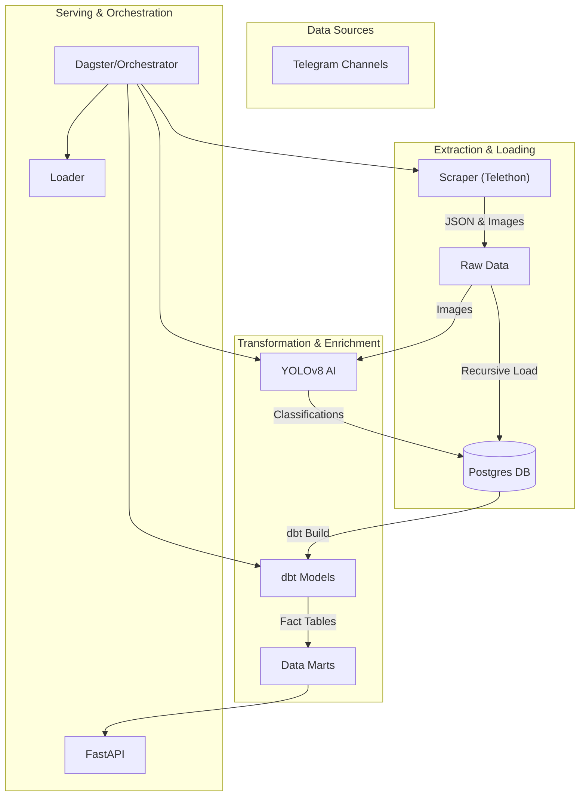

# 🏥 TeleHealth-Analytics


> **"Transforming unstructured Telegram data into actionable healthcare insights through Data Engineering & AI."**

---

## 📖 Table of Contents
- [🔍 Project Overview](#-project-overview)
- [🏗️ Architecture](#lz-architecture)
- [📂 Repository Structure](#-repository-structure)
- [🛠️ Tech Stack](#lz-tech-stack)
- [🚀 Setup & Installation](#-setup--installation)
- [⚡ Pipeline Workflows](#-pipeline-workflows)
- [📊 API & Reporting](#-api--reporting)
- [🧪 Testing](#-testing)

---

## 🔍 Project Overview

**TeleHealth-Analytics** is an end-to-end data engineering solution designed to monitor and analyze Medical Telegram Channels in Ethiopia. It scrapes real-time data, processes images using Object Detection (YOLO), transforms data for analysis (dbt), and serves insights via a REST API.

### Key Features
- **Real-time Scraper**: Monitors multiple channels for keywords and images.
- **AI-Powered**: Uses `YOLOv8` to classify images as *Promotional* or *Product Display*.
- **Data Warehouse**: Structured storage in PostgreSQL with `raw`, `staging`, and `marts` layers.
- **Orchestration**: Fully automated DAGs managing the ETL lifecycle.
- **Analytical API**: Exposes trends, top products, and visual content stats.

---

## 🏗️ Architecture



---

## � Repository Structure

```bash
TeleHealth-Analytics/
├── .github/                # CI/CD Workflows
├── api/                    # Analytical API
│   ├── main.py             # FastAPI App
│   └── schemas.py          # Pydantic Response Models
├── data/                   # Local Data Storage
│   ├── raw/                # Scraped JSONs & Images
│   └── processed/          # AI Results
├── dbt_project/            # dbt Transformation Layer
│   ├── models/             # Staging & Marts
│   ├── tests/              # Data Quality Tests
│   └── dbt_project.yml     # Project Config
├── src/                    # Core Logic
│   ├── collectors/         # Telegram Scraper
│   ├── enrichment/         # YOLO Object Detection
│   ├── loaders/            # Database Loader
│   ├── orchestration/      # Pipeline Definitions
│   └── config.py           # Centralized Configuration
├── docker-compose.yml      # Container Orchestration
├── requirements.txt        # Python Dependencies
└── README.md               # Documentation
```

---

## 🚀 Setup & Installation

### 1. Prerequisites
Ensure you have **Docker** and **Python 3.10+** installed.

### 2. Environment Configuration
Create a `.env` file in the root:
```ini
TG_API_ID=your_id
TG_API_HASH=your_hash
POSTGRES_USER=user
POSTGRES_PASSWORD=password
POSTGRES_DB=telehealth
```

### 3. Initialize Database
Start the PostgreSQL container:
```bash
docker-compose up -d
```

### 4. Install Dependencies
```bash
pip install -r requirements.txt
```

---

## ⚡ Pipeline Workflows

### Phase 1: Data Collection
Run the robust scraper to fetch historical and new messages:
```python
# src/collectors/telegram_scraper.py
async def scrape_channel(client, channel):
    # logic to fetch messages and download images...
```
**Command:** `python src/collectors/telegram_scraper.py`

### Phase 2: Loading & AI Enrichment
Load raw data and run Object Detection:
```python
# src/enrichment/yolo_detect.py
model = YOLO('yolov8n.pt')
results = model(image_path)
# Classifies: 'Person + Bottle' -> Promotional
```
**Command:** `python src/enrichment/yolo_detect.py`

### Phase 3: dbt Transformation
Transform raw data into analytics-ready models:
```sql
-- models/marts/fct_messages.sql
select 
    message_id, 
    channel_key, 
    count(views) as view_count
from {{ ref('stg_telegram') }}
```
**Command:** `dbt build --project-dir dbt_project`

---

## 📊 API & Reporting

Access the interactive API dashboard at `http://localhost:8000/docs`.

**Key Endpoints:**
- `GET /api/reports/top-products`: Trending medical keywords.
- `GET /api/channels/{name}/activity`: Daily post volume.
- `GET /api/reports/visual-content`: Image classification breakdown.

---

## 🧪 Testing

We rely on **dbt tests** for data integrity:
```yaml
# dbt_project/tests/assert_positive_views.sql
select * from {{ ref('stg_telegram') }} where view_count < 0
```

Run all tests:
```bash
dbt test --project-dir dbt_project
```

---
*Built with ❤️ by the TeleHealth Data Engineering Team.*
